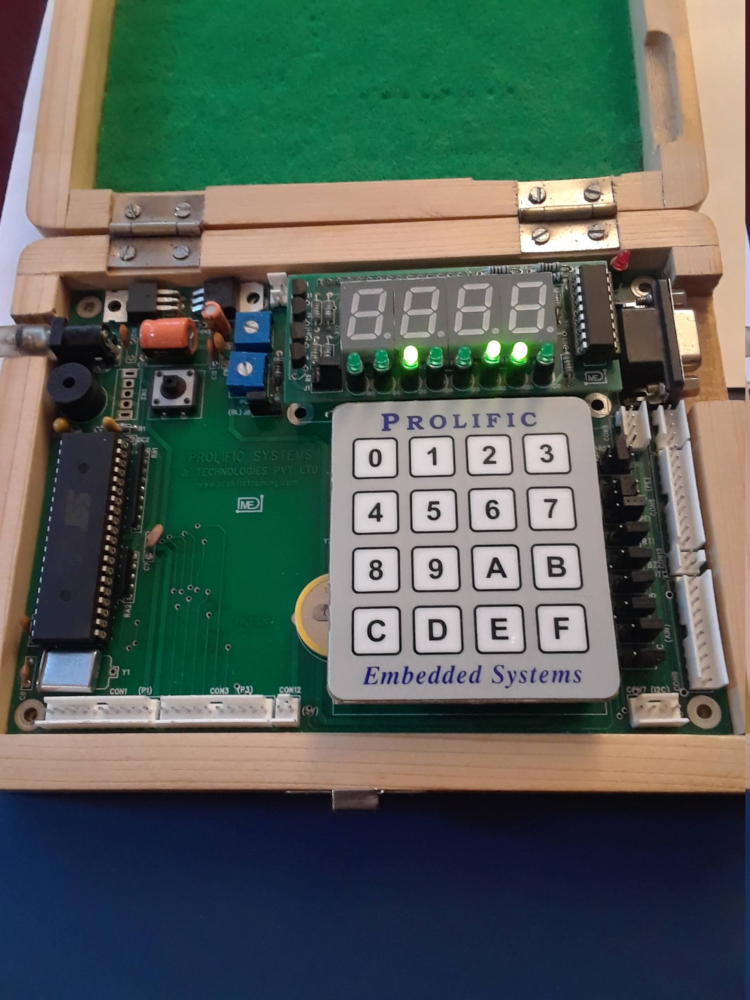

# led
Program to turn on certain LEDs in a row of 8 LEDs

## Getting Started

### Requirements
* Keil IDE
* Flash Magic
* 8051 microcontroller
* LEDs (x8)

### Installing
1. Connect LEDs to Port 0 of the 8051 microcontroller
1. Open Keil and create new project
   * Choose Philips 8xC51RD+ database
1. Add led.c file to Source Group
1. Build target
1. Use Flash Magic to write the resulting hex file to the 8051 microcontroller

### Example

We can turn the 3rd, 6th, and 7th LEDs on by programming Port 0 to 0x26, which is 00100110 in binary.

## Authors

* **Sahil Mahajan**

## License

This project intentionally has no license.
